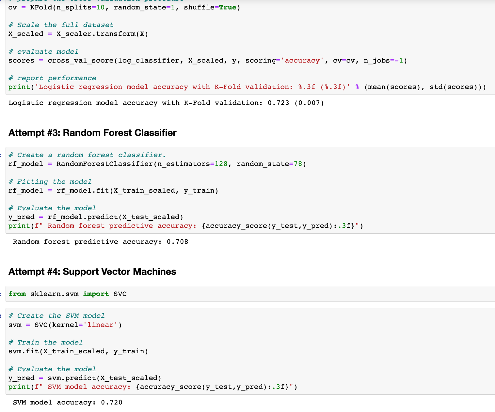

# Neural Network Charity Analysis

## Overview

The purpose of this project is to build a binary classifier to predict whether applicants will be successful if funded by Alphabet Soup. One of the main ideas is to compare different machine learning models (NNs, SVM, LogisticRegression, RandomForestClassifier) and try various optimization techniques to improved the classifier performance.

I will follow the following are the steps :

1: Preprocessing Data for a Neural Network Model
2: Compile, Train, and Evaluate the NN Model
3: Optimize the Model
4: Build SVM, LogisticRegression and RandomForestClassifier models to compare the performance

## Results

### Data Preprocessing

<u>Data Structure</u>

- EIN and NAME (I will drop these columns as they are only identification columns)

Feature variables:
- APPLICATION_TYPE — Alphabet Soup application type
- AFFILIATION — Affiliated sector of industry
- CLASSIFICATION — Government organization classification
- USE_CASE — Use case for funding
- ORGANIZATION — Organization type
- STATUS — Active status
- INCOME_AMT — Income classification
- SPECIAL_CONSIDERATIONS — Special consideration for application
- ASK_AMT — Funding amount requested

Target variable:
- IS_SUCCESSFUL — Was the money used effectively

### Compiling, Training, and Evaluating the Model

#### Model Architecture

After one-hot encoding the categorical variables I ended up with 43 features. The model will have a number of input nodes equal to a number of input features. The first hidden layer will have 80 nodes as we would typically have 2-3 times the number of the input nodes. And the second hidden layer will have 30 nodes. 

The performance of the NN model with these parameters was at 0.71:

<insert picture>

This was below the target performance of 0.75 and experimented with some optimization parmeters to see if a better performance could be achieved. Some of the changes I have tried are:

1. Change the loss function to MSE, Adamax, categorical_crossentropy - these changes did not have any impact on the model performance and the accuracy remained the same.

2. Increase the number of nodes in hidden layers - this change has decreased performance of the model.

3. Increasing learing rate to 0.05 for adam optimizer has increased the performace of the model but very slightly.

In addition to the NN model, I have built LogisticRegression, SVM and RandomForestClassifier. The accuracy of these models was comparable to the NN model but the training time was significantly lower. For LogisticRegression model I had added K-fold validation to see if this could improve the performance but it did not have any impact on the accuracy of the model.

I have further tried some changes to the input features to see if that could improve the accuracy of the model.

1. Dropping Application_Type and Classification made the resuts worse for all the models

2. Binning income amount into fewer categories - this change has increased the performace of all the models but very slightly.

## Summary
Overall, Neural Network did not perform any better than other models but was much more computationally expensive. This proves that sometimes simpler models may be just as effective as complex neural nets while being much faster. 